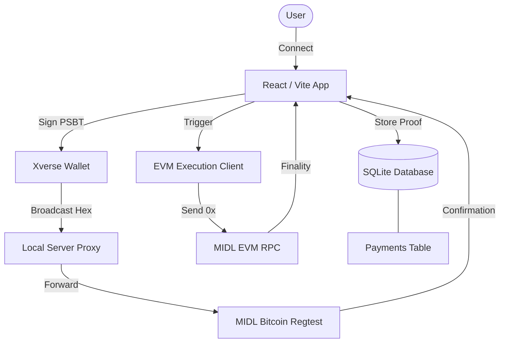

# 🏗️ Crypto-X: Technical Architecture Documentation

This document provides a comprehensive overview of the **Crypto-X** dual-chain architecture, integrating Bitcoin (Layer 1) and EVM (Execution Layer) via the MIDL Infrastructure.

---

## 🛰️ System Overview

Crypto-X is a boutique digital asset marketplace that utilizes a hybrid blockchain settlement model:
1.  **Primary Settlement (Bitcoin)**: Users pay in BTC using Xverse/UniSat wallets.
2.  **Secondary Execution (EVM)**: A post-confirmation trigger executes an EVM transaction (e.g., for asset registration or minting) linking it permanently to the Bitcoin transaction.

### 🗺️ Infrastructure Diagram



---

## ₿ Bitcoin Payment Flow

### 1. Wallet Interaction
- **SDK**: Utilizes `@midl/react` and `@midl/core`.
- **PSBT Extraction**: Since Xverse returns a signed PSBT, the app extracts the raw transaction hex locally to ensure reliable broadcasting and tracking.
- **Network Spoofing**: To maintain Xverse compatibility with local Regtest, the app uses a `Testnet` spoofing strategy in `lib/midlConfig.ts`, allowing `bcrt1` addresses to be treated correctly.

### 2. Local Proxy Layer
The local server (`server/src/index.ts`) acts as a critical intermediary:
- **Xverse Compatibility**: Spoofs headers and handles JSON/Text body transformations required by the Xverse extension.
- **RPC Forwarding**: Proxies requests to `mempool.staging.midl.xyz` for zero-conf detection.

---

## 🛡️ EVM Execution Layer

Following a successful Bitcoin broadcast, the system automatically initiates the **EVM Execution Layer**.

### 1. The Trigger (`executeEVMAction`)
In `lib/evmClient.ts`, a silent background process:
- Connects to the **MIDL EVM RPC**.
- Generates an EVM transaction containing the Bitcoin `txid` and Order Metadata.
- Returns a `0x` hash immediately to the UI.

### 2. Dual-Chain Correlation
The system links the two chains via the database:
| Column | Description |
| :--- | :--- |
| `txid` | The Bitcoin transaction ID. |
| `evm_tx_hash` | The corresponding EVM execution hash. |
| `evm_status` | Status of the secondary layer (pending/confirmed). |

---

## 💾 Data Persistence (SQLite)

The backend maintains the integrity of orders in `payments.db`:
```sql
CREATE TABLE payments (
    id INTEGER PRIMARY KEY AUTOINCREMENT,
    order_id TEXT UNIQUE,
    txid TEXT,
    evm_tx_hash TEXT,
    evm_status TEXT DEFAULT 'pending',
    amount INTEGER,
    wallet_address TEXT,
    status TEXT,
    confirmations INTEGER,
    created_at DATETIME DEFAULT CURRENT_TIMESTAMP
);
```

---

## ⚙️ Configuration

### Environment Variables
| Variable | Description | Default |
| :--- | :--- | :--- |
| `VITE_MIDL_EVM_RPC` | RPC Endpoint for the EVM Layer | `https://rpc.staging.midl.xyz` |
| `VITE_EVM_PRIVATE_KEY`| Private key for the automated signer | *(Optional: Mocks if absent)* |
| `MIDL_RPC_URL` | Bitcoin Regtest RPC | `https://mempool.staging.midl.xyz/api` |

---

## 🚀 Future Roadmap
- **Smart Contract Integration**: Moving from self-send transactions to specific bridge contracts.
- **Direct Webhook Triggers**: Implementing server-side EVM execution upon BTC confirmation (V3).
- **Multi-Asset Support**: Extending the execution layer to support BRC-20 and ERC-20 simultaneously.

---
**Documented by Antigravity AI**
*February 20, 2026*
